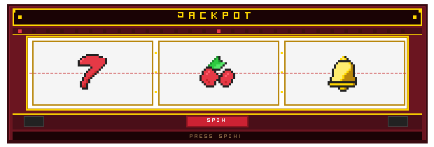

## Hi. I'm Moon Jihye. 👋
AI가 발전하는 시대 속에서 변치 않는 것이 있다면 '목적'이라 생각합니다. 주어진 상황에서 본질이 무엇인지 파악하고 최적을 찾을 수 있는 개발자로 성장중인 문지혜입니다.

   

## Tech Stack
<table>
  <tr>
    <td align="center" width="140">Language</td>
    <td>
      
      
      
      
    </td>
  </tr>
  <tr>
    <td align="center">Backend & DB</td>
    <td>
      
      
      
      
      
      
    </td>
  </tr>
  <tr>
    <td align="center">DevOps</td>
    <td>
      
      
      
      
      
      
      
    </td>
  </tr>
  <tr>
    <td align="center">Tools</td>
    <td>
      
      
      
      
      
      
      
    </td>
  </tr>
</table>

   

## Project

## Awards & Certifications
| 기간 | 내용 | 수상 / 등급 | 주최 · 발급 |
|:---:|:---|:---:|:---|
| 2026.04 | OPIc 일본어 | AL | ACTFL |
| 2023.05 | 내일하루 — 실시간 모임 매칭 웹 플랫폼 | 🥈 우수상 | 강남대학교 학술제 |
| 2023.05 | 멋사 대학 동아리 자체 웹 서비스 | 🥉 장려상 | 강남대학교 학술제 |
| 2022.12 | (도시데이터 해커톤 동시 수상)    공공데이터 활용 방안 및 웹 서비스 개발 내용 발표 | 🥉 장려상 | 강남대학교 학술제 |
| 2022.12 | 공공데이터 활용 시설 관리 웹 서비스 | 🏅 발전상 | 서울시 IoT 도시데이터 해커톤 |
| 2022.12 | (한이음 동시 수상)    2022년도 한이음 활동 내용 및 눈 깜빡임 감지 알고리즘 발표 | 🥈 우수상 | 강남대학교 학술제 |
| 2022.12 | 라즈베리파이 & OpenCV 졸음 운전 방지 시스템 | 🥉 장려상 | 한이음 IoT 공모전 |

   

## History
> **2026.06 ~ 현재** · 🎓 교육  
> **멋쟁이 사자처럼 | 백엔드 부트캠프 26기** — Java & Spring  
> Spring Boot 기반 백엔드 개발과 AWS 인프라 운영 실무 중심 교육

> **2020.03 ~ 2024.08** · 🎓 교육  
> **강남대학교 소프트웨어응용학부**  
> 주전공 컴퓨터공학, 부전공 데이터사이언스 졸업

> **2023.03 ~ 2023.06** · 💡 경험  
> **멋쟁이 사자처럼 대학 동아리**  
> 백엔드 트랙 · 웹 개발 기초부터 팀 프로젝트, 학술제 수상

> **2022.03 ~ 2022.12** · 💡 경험  
> **한이음 ICT 멘토링 프로젝트**  
> 산학 연계 · 요구사항 분석~발표 전 과정 수행, 학술제·공모전 수상
   
   

## 📬 Contact
* **Email** : jihyer0395@gmail.com   

---
   

  

   
   

<!--

    

-->

